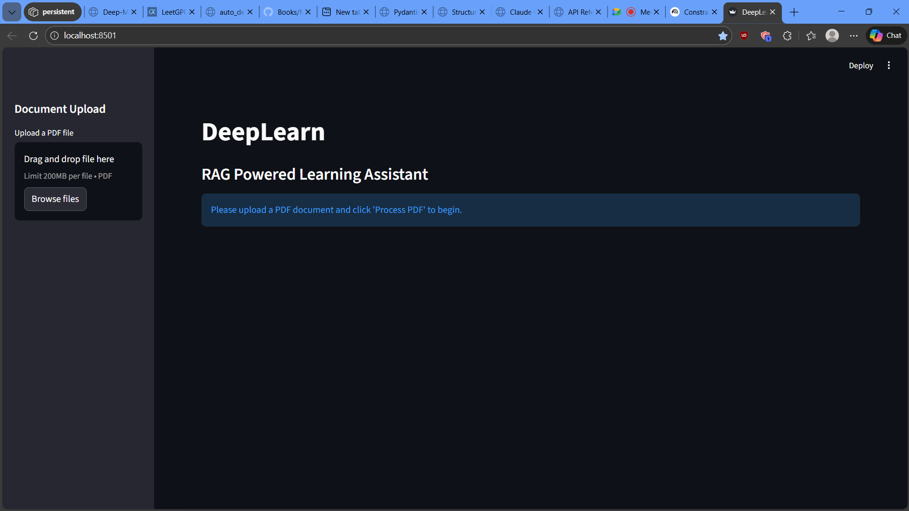
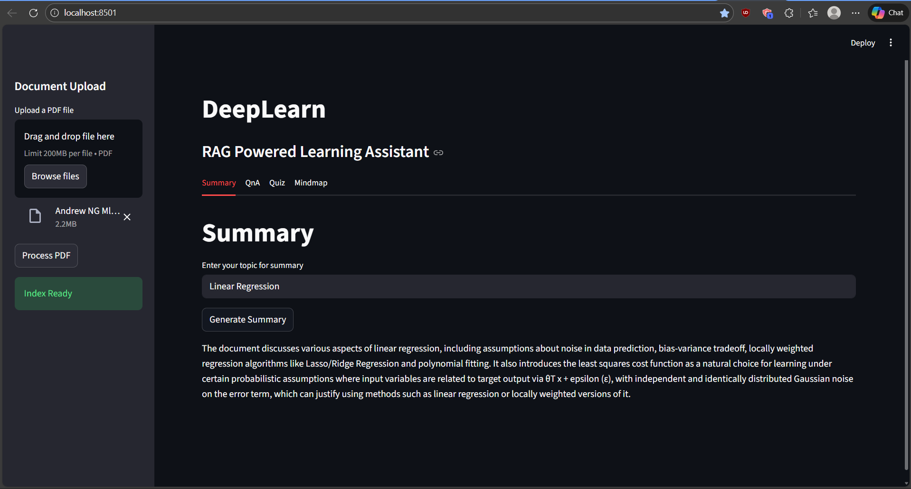
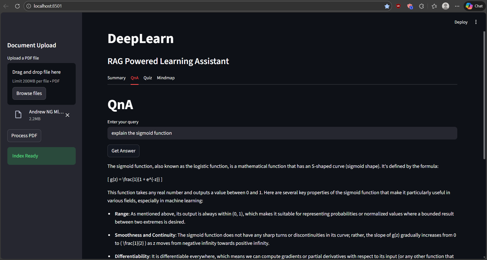
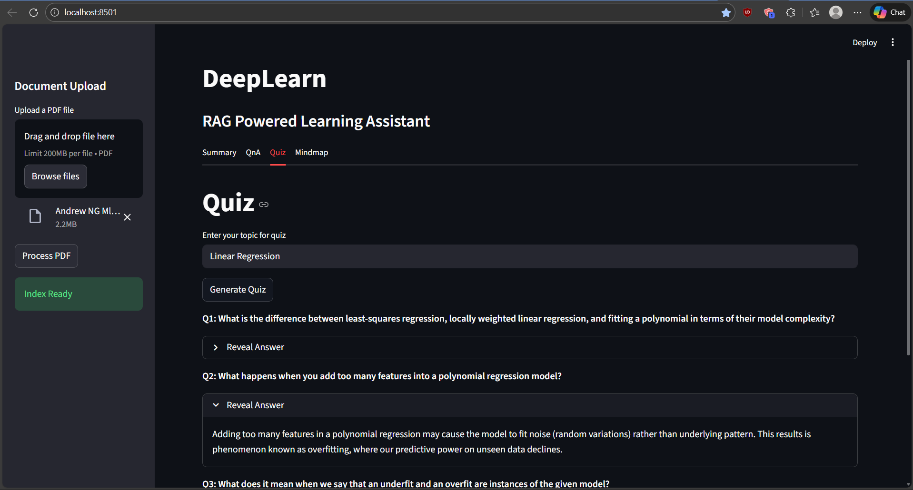
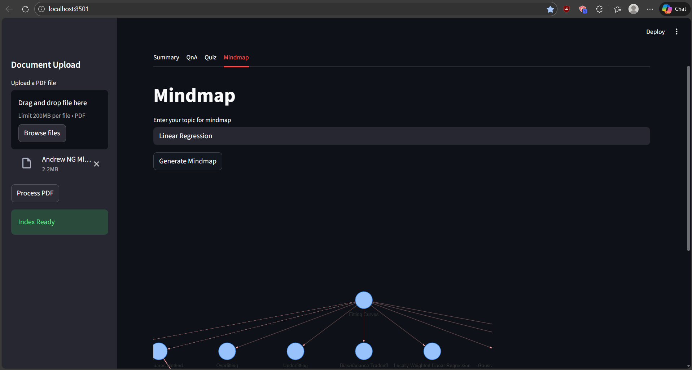
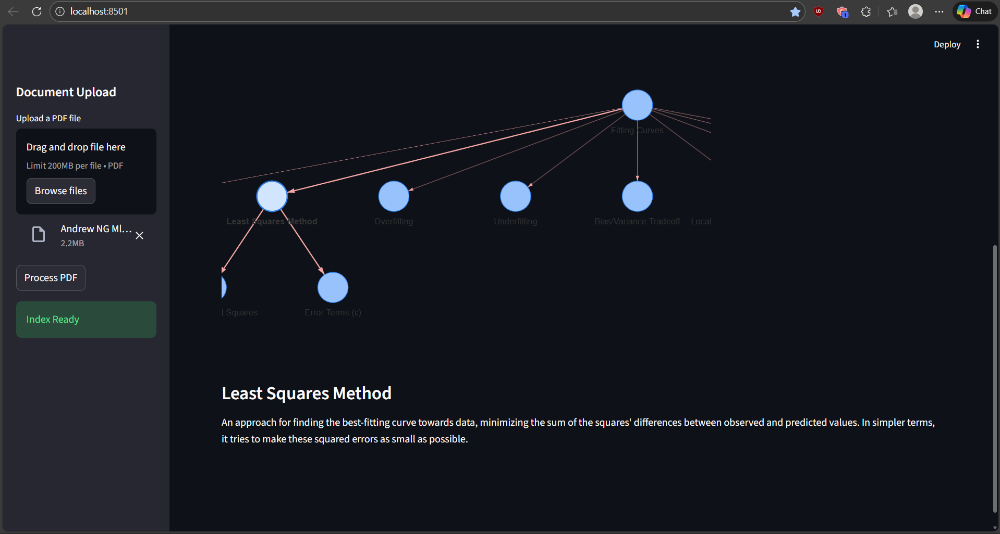

# DeepLearn: RAG Powered Learning Assistant

DeepLearn is a LLM-based application designed to assist in learning from documents using Retrieval-Augmented Generation (RAG). It allows users to upload PDF documents and interact with them through summarization, question answering, quiz generation, and mindmap visualization.

## Tech Stack

*   **Language:** Python
*   **Web Framework:** Streamlit
*   **LLM Integration:** LangChain, Ollama
*   **Vector Store:** FAISS
*   **Embeddings:** HuggingFace Embeddings (sentence-transformers/all-MiniLM-L6-v2)
*   **Visualization:** Streamlit Agraph

## Model Configuration

The application uses the following configuration for the Ollama model:

```python
MODEL_NAME = "phi3:mini"

# Temperature Settings
SUMMARY_TEMP = 0.7
QNA_TEMP = 0.7
QUIZ_TEMP = 0.7
CONCEPT_EXTRACTION_TEMP = 0.8
MINDMAP_TEMP = 0.8
```

## Features

*   **PDF Upload:** Upload PDF documents which are processed and indexed for retrieval.
*   **Summary:** Generate concise summaries of the document content based on a user-provided topic.
*   **Q&A:** Ask questions about the document and receive accurate answers.
*   **Quiz:** Generate quizzes to test your understanding of the material, with revealable answers.
*   **Mindmap:** Visualize concepts from the document in a hierarchical tree structure.

## Data Models

The application uses Pydantic models to structure the output from the LLM. Below are the example formats for these classes.

### Concept Extraction

Used for extracting key concepts to build the mindmap.

```python
class Concept(BaseModel):
    concept: str = Field(description="The concept")
    definition: str = Field(description="The definition of the concept")

class Concepts(BaseModel):
    concepts: List[Concept] = Field(description="The concepts")
```

### Mindmap Structure

Used for defining the hierarchical structure of the mindmap.

```python
class Node(BaseModel):
    node: str = Field(description="The node")
    description: str = Field(description="The description of the node")
    children: List['Node'] = Field(description="The children of the node")

class RootNode(BaseModel):
    root: str = Field(description="The root of the mindmap")
    description: str = Field(description="The description of the root")
    children: List[Node] = Field(description="The children of the mindmap")
```

### Quiz Generation

Used for generating quiz questions and answers.

```python
class Question_Answer(BaseModel):
    question: str = Field(description="The question")
    answer: str = Field(description="The answer")

class Quiz(BaseModel):
    quiz: List[Question_Answer] = Field(description="The quiz")
```

### JSON Output Examples

The LLM is enforced to output using the structured output format argument included with the ollama chat method. Here are the structured output formats the LLM makes use of:

#### Concept Extraction Format

```json
{
    "concepts": [
        {
            "concept": "conept 1 (Text)",
            "definition": "definition 1 (Text)"
        },
        {
            "concept": "concept 2 (Text)",
            "definition": "definition 2 (Text)"
        },
        {
            "concept": "concept 3 (Text)",
            "definition": "definition 3 (Text)"
        }]
}
```

#### Mindmap Structure Format

```json
{
  "root": "concept 1 (str)",
  "description": "description 1 (str)",
  "children": [
    {
      "node": "concept 2 (str)",
      "description": "description 2 (str)",
      "children": [
        {"node": "concept 3 (str)", "description": "description 3 (str)", "children": [
            {"node": "concept 4 (str)", "description": "description 4 (str)", "children": []},
            {"node": "concept 5 (str)", "description": "description 5 (str)", "children": []}
        ]},
        {"node": "concept 6 (str)", "description": "description 6 (str)", "children": []},
        {"node": "concept 7 (str)", "description": "description 7 (str)", "children": []}
      ]
    },
    {
      "node": "concept 8 (str)",
      "description": "description 8 (str)",
      "children": [
        {"node": "concept 9 (str)", "description": "description 9 (str)", "children": []},
        {"node": "concept 10 (str)", "description": "description 10 (str)", "children": []},
        {"node": "concept 11 (str)", "description": "description 11 (str)", "children": []}
      ]
    }
  ]
}
```

#### Quiz Format

```json
{
  "quiz": [
    {
      "question": "Question 1 text?",
      "answer": "Answer 1 text."
    },
    {
      "question": "Question 2 text?",
      "answer": "Answer 2 text."
    }
  ]
}
```

## Setup and Usage

1.  **Prerequisites:**
    *   Python 3.8+
    *   Ollama running locally with the `phi3:mini` model (or your configured model).
    *   Dependencies installed (see `requirements.txt`).

2.  **Run the Application:**

    ```bash
    streamlit run app/streamlit_app.py
    ```

3.  **Usage:**
    *   **Upload:** Use the sidebar to upload a PDF file. Click "Process PDF".
    *   **Navigate:** Use the tabs to switch between Summary, QnA, Quiz, and Mindmap.

## Demo

### File Upload


### Summary Generation


### Question and Answering


### Quiz Interface


### Mindmap Query


### Mindmap Visualization

